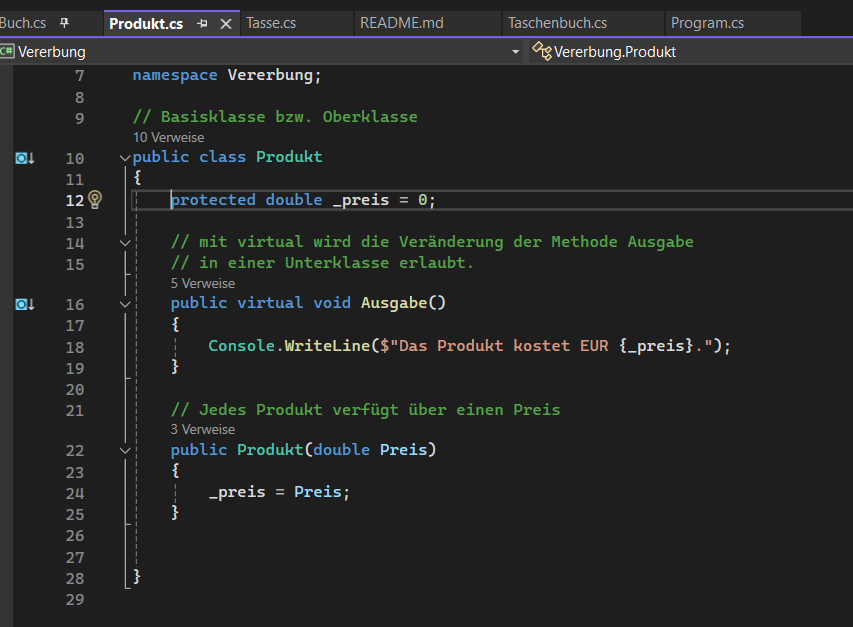
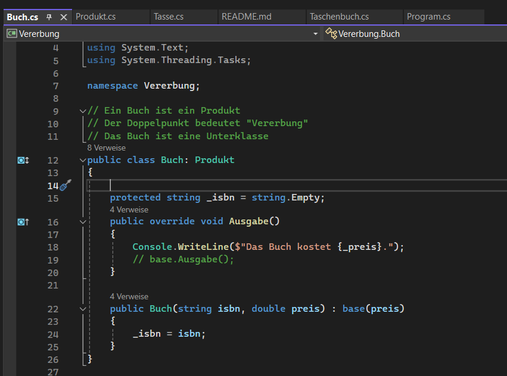
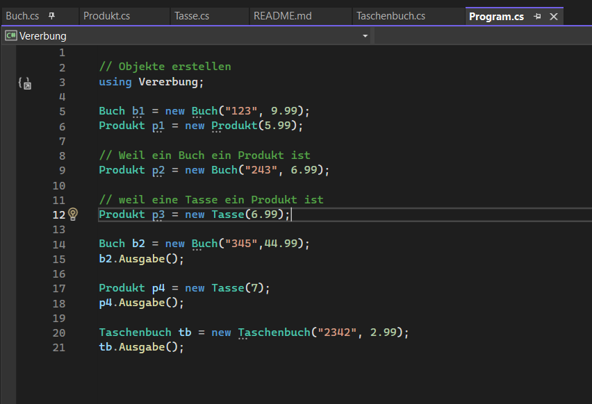

# Vererbung

Präsentation von *Noah Tenk & Lanuel Lukic*
---
Layout: image-right
---
# Inhaltsverzeichnis

- Was ist eine Vererbung?
- Was muss ich dafür können?
- Wann wendet man sie an?
- Welche Vorteile habe ich damit?
- Wie Verwende ich eine Vererbung?

---

# Die Vererbung

- Verbindung zweier Klassen
- Oberklasse verebt Eigenschaften und Methoden an Unterklasse
- überschreiben - override
- Ziel: Code wiederverwenden

---
# Vererbung - Fähigkeiten

- *1. Kentnisse der Programiersprache*
- *2. Objektorientierte Programmierung (OOP)*
- *3. Grundlagen der Vererbung*

---
# Wann wendet man die Vererbung an

- bei mehrmaliger Nutzung von Methoden

---

# Vorteile der Vererbung

- Weniger Aufwand
- Zeitsparend
- Effizient

---
# Wie verwende ich eine Vererbung?

